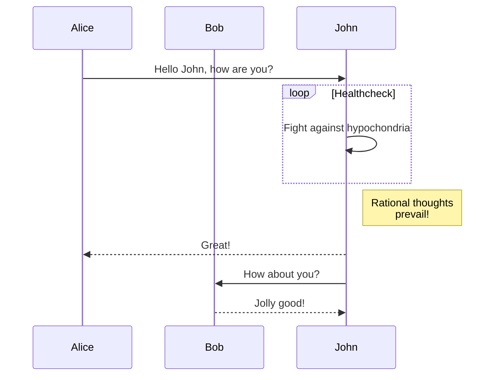
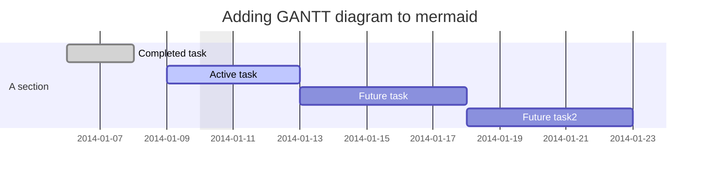

# Basic

## Navbar

```yaml
nav:
    - Home: index.md
    - Material Theme: theme.md
    - Basic: basic.md
```

## Markdown Extended

To extend markup instructions we will use PyMdown Extensions:

```
$ poetry add --dev pymdown-extensions
```

More information in [PyMdown Extensions](https://facelessuser.github.io/pymdown-extensions/)

## Format

 - **Bold** 
 - *italic* 
 - >quote.

List

1. fist one
2. last one

unordered list

- item A
- item B

code

`my_variable='definition'`

link

[DuckDuckGo](https://duckduckgo.com/)

image


table

|Name|age|
|----|---|
|Elson| undefined|
|Duda|10|

 code block (fences)

```
def my_function:
    return 1
```

emoji :smile:

I don`t now
~~line~~

Mark

==Mark==

todo list

- [ ] todo

```{.py3 hl_lines="1-3 9" linenums="8" tile="main.py"}
#!/usr/bin/python3
# -*- coding: utf-8 -*-
#

# Start
if "__main__" in __name__:
    print('hello world')

# End of code

```

## custom fences 
See more in [Mermaid docs](https://mermaid-js.github.io/mermaid/#/)

Flowchart


Sequence diagram


Gantt diagram


# Export PDF

```shell
$ poetry add --dev mkdocs-with-pdf
```

```{.yml tile="mkdocs.yml"}
plugins:
    - with-pdf
```

More information in [MkDocs PDF Export Plugin](https://github.com/zhaoterryy/mkdocs-pdf-export-plugin)


